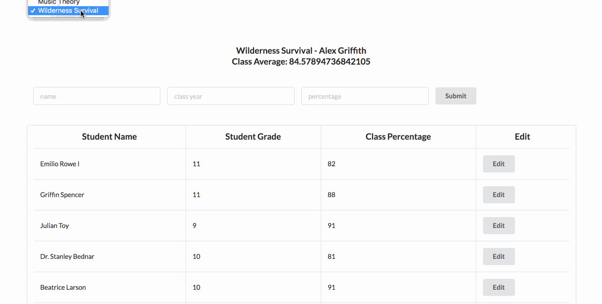

# React Immersive Code Challenge

## Instructions

For this project, you’ll be building out a React application that displays a list of student grades.

Part of what this code challenge is testing is your ability to follow given instructions. While you will have some freedom in how you implement the features, be sure to carefully read the directions and follow the steps in order to build the application. **It would be better to deliver 4 working and 3 not-working deliverables rather 7 half-working deliverables.**

Before the code challenge begins, you will receive a user ID from your instructors. You will use this anywhere you see `user_id` to get access to your own set of data. If you do not yet have an ID, please let an instructor know. 

## Setup

1. Fork and clone this repository.
2. After cloning down the project, run `npm install`.
3. You can boot up the server with `npm start`. It should automaticaly run on `localhost:3000`.
4. The backend for this code challenge is hosted on heroku at: https://bayside-high.herokuapp.com/, and the specific endpoints available for use are listed below in the deliverables section.
5. The app uses [Semantic UI](https://semantic-ui.com/) for styling. If you see any unfamiliar classNames on some components, don't sweat! That's coming from Semantic UI and you shouldn't need to touch it.

## Endpoints

The endpoints you need to hit are:

* GET: `https://bayside-high.herokuapp.com/api/v1/users/:user_id/courses`
Returns an array of all courses.
```
GET: `https://bayside-high.herokuapp.com/api/v1/users/:user_id/courses`

Example Response:
  [
    {
      id: 101,
      name: "Swift for Beginners",
      instructor: "Joe Burgess",
      semester: "Summer 2017"
    },
    {
      id: 102,
      name: "Knitting Hats for Cats",
      instructor: "Tim Campbell",
      semester: "Winter 2017"
    },
    {
      id: 103,
      name: "Rock Climbing",
      instructor: "Avi Flombaum",
      semester: "Spring 2017"
    },
    {
      id: 104,
      name: "Home Ec",
      instructor: "Jeff Katz",
      semester: "Winter 2017"
    }
  ]
```

* GET: `https://bayside-high.herokuapp.com/api/v1/users/:user_id/courses/:id`
Returns a single course and all of its students. Example GET fetch for course 1:
```
GET 'https://bayside-high.herokuapp.com/api/v1/users/:user_id/courses/:id'

Example Response:
  {
    "id": 1,
    "name": "Knitting Hats for Cats",
    "instructor": "Tim Campbell",
    "semester": "Winter 2017",
    "students": [
      {
        "id": 10,
        "name": "Irwin Ledner",
        "class_year": 12,
        "percentage": 91
      },
      {
        "id": 13,
        "name": "Jordane Glover",
        "class_year": 11,
        "percentage": 72
      },
      ...
    ]
  }
```
* PATCH: `https://bayside-high.herokuapp.com/api/v1/users/:user_id/students/:id`
Returns updated student data. Example PATCH for student 1:
```
PATCH: 'https://bayside-high.herokuapp.com/api/v1/users/:user_id/students/:id'

Required keys in the body of the request:
{
  class_year: <class_year value from edit form>,
  name: <name value from edit form>,
  percentage: <percentage value from edit form>
}

Required Headers
{
  "Content-Type": "application/json"
}

Example Response:
{
  class_year: 10,
  id: 15,
  name: "Leopoldo O'Keefe",
  percentage: 93
}
```

## Deliverables
Below are the deliverables you should create.

1. Get the list of courses from `https://bayside-high.herokuapp.com/api/v1/users/:user_id/courses` and populate the dropdown menu.
2. Ensure that the dropdown course menu updates the currentCourse state in CourseContainer. You should also show the name of the current course as a header in CourseContainer.
3. On change of the dropdown course menu, a call should be placed to the API to update the student state. This information can be retrieved from the endpoint for each course: `https://bayside-high.herokuapp.com/api/v1/users/:user_id/courses/:id`. Make sure you know how the data you receive from the API is structured.
4. Make student information editable using the edit form. Clicking the button next to a student should populate the edit form with information for that student. Make this form a controlled component.
5. On submit, persist the updated student information to the API using a PATCH request to `https://bayside-high.herokuapp.com/api/v1/users/:user_id/students/:id`. The updated student information should also be reflected on the front end. (When using `fetch` to make a PATCH request, make sure you capitalize the `{method: 'PATCH'}`)
6. If you have time, refactor the Edit Student form into its own component.
7. Note: All your coding should be done in this repo. You should not need to make any changes to the back end and there is no need to push the back end up upon submission.



Use the above gif as an example of how the app should function.

## Criteria

We’ll be evaluating your code based on the following criteria:

* **React Components:** Does the app reasonably separate responsibilities into components and a have a component hierarchy?
* **Props:** Does the app have at least one presentational component that receives props? Does the app pass props down from a higher-level component to a lower one? Does the app make use of passing a functional prop?
* **State:** Does the app have a dropdown menu that responds to changes and calls this.setState? If an individual student is updated, does the state reflect that change?
* **API:** Does the app make a fetch request to the API and return data? Does the update API call correctly persist student changes in the back end?
* **Best Practices:** Does the app follow best practices regarding state and component composition? Is code structured cleanly? Are functions defined in the components they are most related to?

Good luck!
